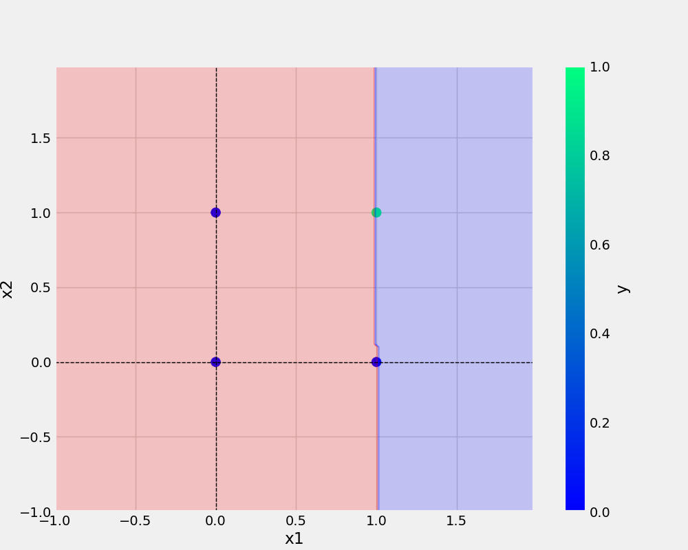

# oneNeuron
Perceptrion


## Add image - 



## python code
```python
from utils.model import Perceptron
from utils.all_utils import prepare_data, save_model, save_plot
import pandas as pd
import numpy as np
import logging
import os 


logging_str = "[%(asctime)s: %(levelname)s: %(module)s ] %(message)s"
log_dir = "logs"
os.makedirs(log_dir,exist_ok=True)
logging.basicConfig(filename= os.path.join(log_dir,"Runnig_logs_and.log"),level=logging.INFO, format=logging_str,filemode="a")


def main (data,eta,epochs,filename,plotname):

    df= pd.DataFrame(data)
    logging.info(f"This is the actual DataFrame{df}")
    ## Implementing Prepare_data method from all_utils.py
    x,y = prepare_data(df) 

    

    model = Perceptron(eta=eta, epochs=epochs)
    model.fit(x,y)

    _ = model.total_loss()

    save_model(model,filename=filename)
    save_plot(df,plotname,model)


if __name__ == "__main__": ## << entry point

        ##    Implementing Truth Table [AND DATASET] 
    AND = {
            "x1": [0,0,1,1],
            "x2": [0,1,0,1],
            "y": [0,0,0,1]
    }

    ETA = 0.3 ## 0 AND 1
    EPOCHS = 10
    try:
        logging.info(">>>>> starting training >>>>>")
        main(data=AND,eta=ETA,epochs=EPOCHS,filename="and_main.model",plotname="and_main.png")
        logging.info("<<<<< training done successfully<<<<<\n")
    except Exception as e: 
        logging.exception(e)
        raise e
```